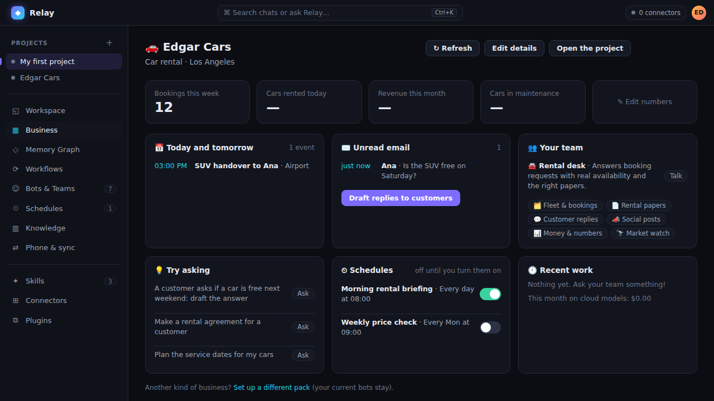

# Relay

**A desktop AI workstation for Mac and Windows.** Chat with local and cloud models, build bots and teams that work
for you, run your business from one dashboard, and talk to it with your voice. Relay learns how you work and gets
better the more you use it. Your keys and data stay on your computer.

## Download

Get the latest version from **[Releases](../../releases/latest)**.

| Computer | File |
|---|---|
| Mac with Apple Silicon (M1–M4) | `Relay-x.y.z-arm64.dmg` |
| Mac with Intel | `Relay-x.y.z-intel.dmg` |
| Windows 10/11 (64-bit) | `Relay-Setup-x.y.z.exe` |

**Mac:** open the DMG and drag Relay to Applications. The first time, right-click Relay → **Open** → **Open**
(the app isn't notarized by Apple). Needs macOS 13 or newer.
**Windows:** run the installer. If SmartScreen warns you, click **More info** → **Run anyway**.

After that, Relay updates itself: Settings → Updates → type `Viking818/Relay` → Save.

## What it does

**Learns as you go.** Relay remembers what matters about you and your work, drafts skills from tasks it has done
(you approve them), searches your old chats when you say "like last time", and keeps long chats sharp with
summaries. Anything it picked up while reading outside text waits for your OK on the Learning page. Coming from
Hermes Agent? Relay imports its memory, skills, model, keys and persona.

**Models.** Ollama, LM Studio, OpenAI, Anthropic, Google Gemini, OpenRouter or any OpenAI-compatible server. Mix
local and cloud models, with a monthly budget for cloud use.

**Bots and teams.** Give each bot its own instructions, model, files, skills and voice. Put bots in a team with a
lead who hands out the work, or run them one after another. For work that splits into parts, a bot can start
helpers that work at the same time.

**Business.** Pick your kind of business (car rental, restaurant, shop, salon, real estate, agency, trades,
consulting, clinic front desk or any other) and Relay sets up the bots, a team, a project and schedules. The
dashboard shows today's calendar, unread email, your own numbers and recent work.

**Email and calendar.** Bots read your mail and save draft replies. Sending always shows you the whole email
first. Calendars connect through their private iCal link.

**Work done for you.** Bots write Word, Excel, PowerPoint and PDF files and charts, search and read the web, make
pictures, run terminal commands you approve (on this computer, on your NAS or servers over SSH, or in a Docker
sandbox), and use their own browser window. Schedules let them work on a timetable; just ask in chat ("every
weekday at 8, summarise my email").

**Your knowledge.** Point a knowledge base at your folders and bots answer from your own documents.

**Voice.** Push to talk, hands-free conversation, or just say **"Hey Relay"**. Speech recognition runs on your
computer; answers are read aloud as they're written.

**Everywhere.** Use Relay from your phone on your home Wi-Fi or through your own Telegram, Discord or Slack bot,
and keep projects, chats and bots the same on all your computers through your cloud drive (encrypted).

**Relay Doctor.** One click checks your models, Ollama, voice, sync, chat apps, email and updates, and fixes what
it can.

**Connect more.** Skills, connectors (MCP) and plugins.

## Safety and privacy

- API keys and passwords are encrypted with your computer's keychain and never shown to the page or synced.
- Anything that changes things (terminal commands, purchases or form submissions in the browser, sending email,
  new schedules) asks you first. Scheduled runs never send email or run commands that delete things.
- Text from web pages and emails is treated as information, never as instructions, and can't teach Relay anything
  without your OK. Relay never keeps passwords or keys in what it learns.
- Telegram, Discord and Slack only answer accounts you paired, and only the person who asked can approve.
- Bots can't reach your home network unless you allow it.
- Updates are only installed when they carry Relay's release signature.

See [SECURITY.md](SECURITY.md) for the full security review.

## License

© 2026 Edgar. All rights reserved. You may download and use the app for free; see [LICENSE](LICENSE) for what
isn't allowed.
